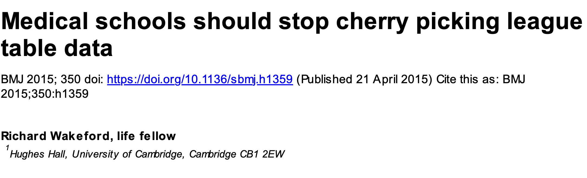
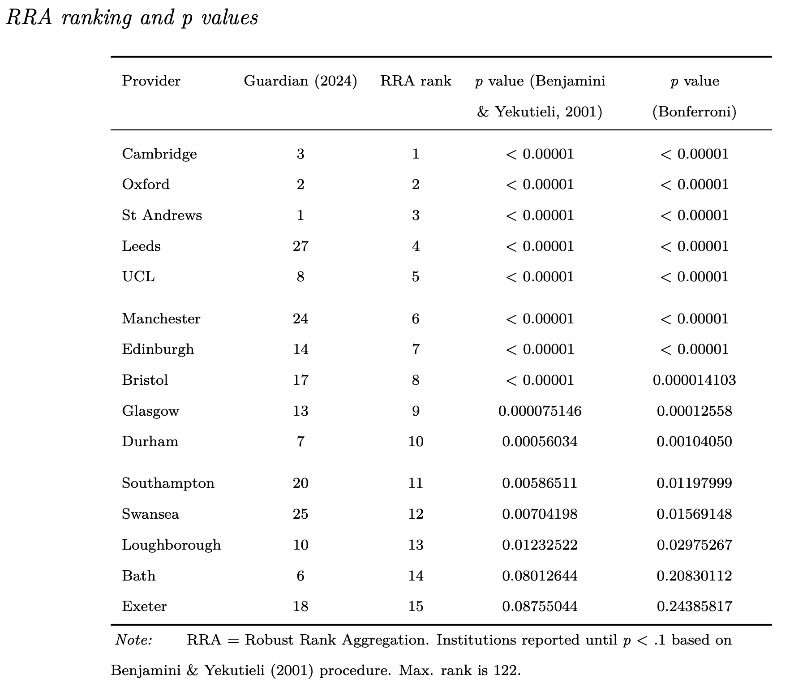
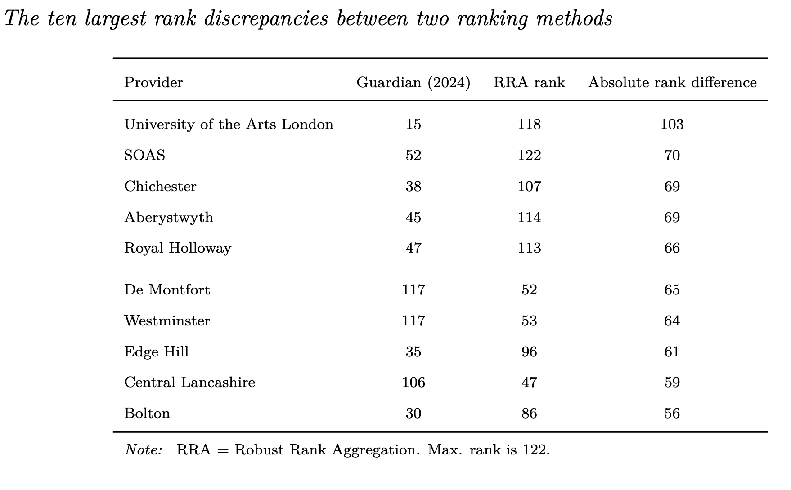
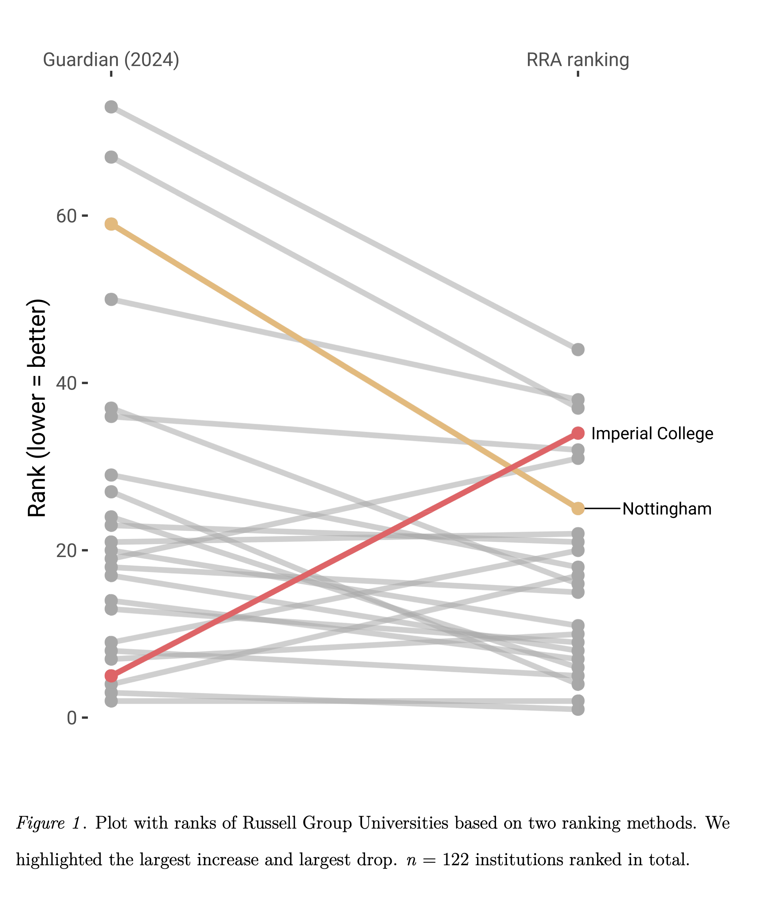
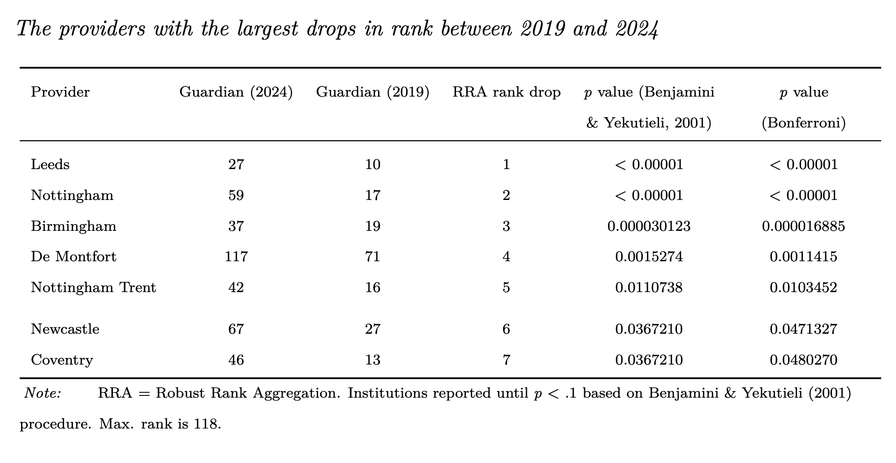
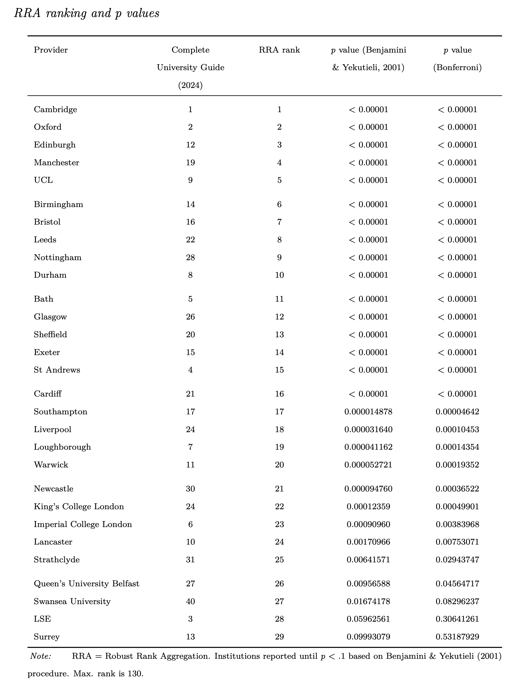
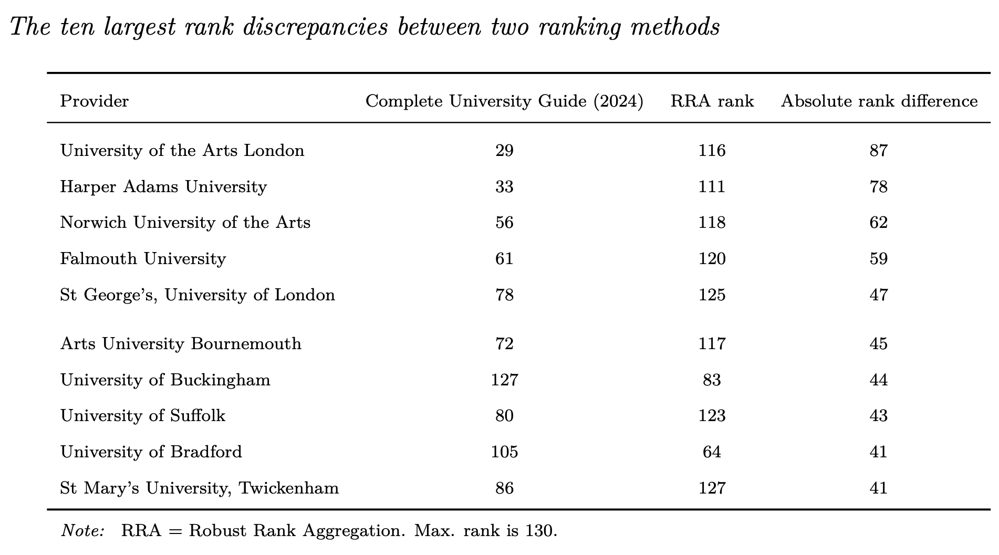
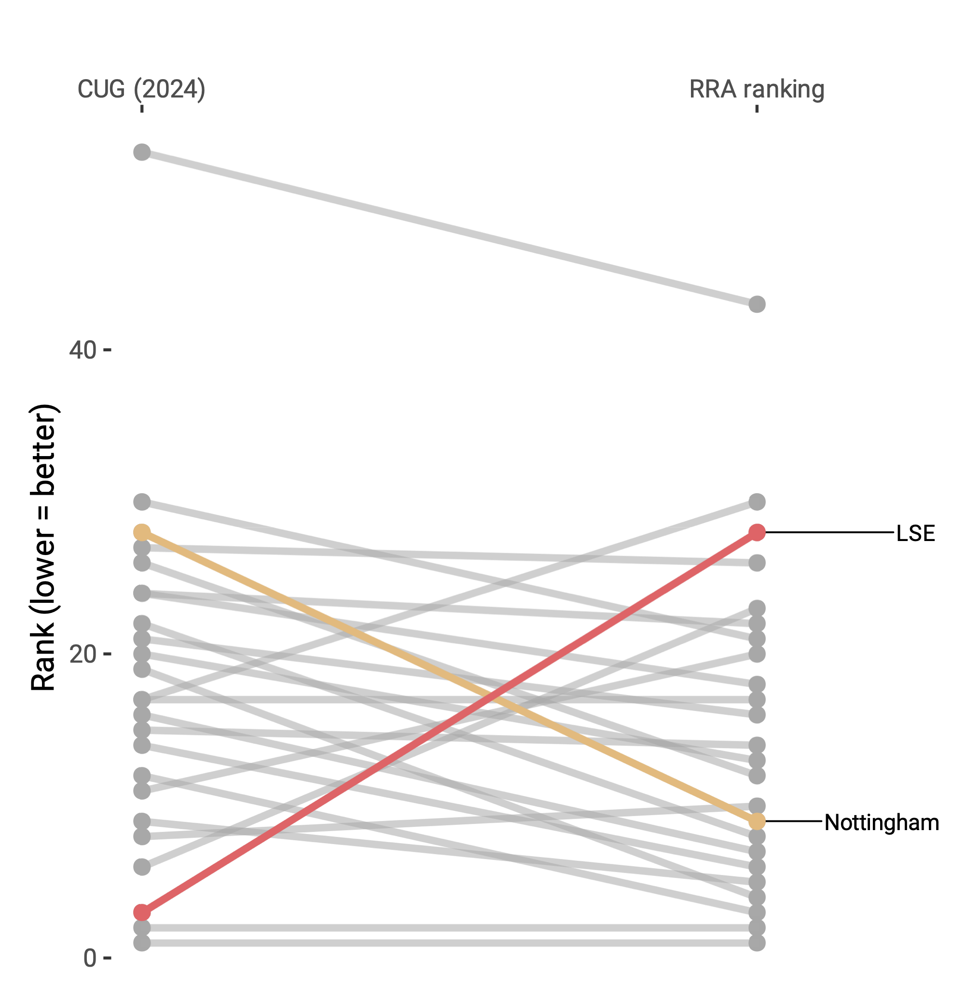

```{r setup, include=FALSE}
options(htmltools.dir.version = FALSE)
knitr::opts_chunk$set(echo = TRUE)
```

```{r echo=F, message=F, warning = F}
require(xaringanExtra) 
require(stargazer)
require(tidyverse)
require(knitr)
require(kableExtra)
require(DT)
```

```{r xaringan-logo, echo=FALSE}
xaringanExtra::use_logo("NU2.png")
```

```{r xaringan-tile-view, echo=FALSE}
xaringanExtra::use_tile_view()
# Below generates a new class of simulation table, as otherwise it will not fit.
```

```{css, echo = F}
table {
  font-size: 16px;     
}
```

```{css, echo = F}
.table_small table {
  font-size: 5.9px;     
}
```

```{css, echo = F}
.table_red table {
  font-size: 10px;     
}
```

## Today

* Work in progress.

* Largely a descriptive project.

```{r, out.width = "400px", echo=FALSE, fig.align='center'}
knitr::include_graphics("https://media.giphy.com/media/n6ljtq0aO6Zqg/giphy.gif") 
```

---
## Methodology

* I really like 'quirky' quantitative methods.

--

* Interested in metrics.

```{r, out.width = "400px", echo=FALSE, fig.align='center'}
knitr::include_graphics("https://media.giphy.com/media/v1.Y2lkPTc5MGI3NjExaXU0NmJqaHlrem5lYW1lZmpmOXp6amJwa2x1b211eW8za2dvZXR3dCZlcD12MV9pbnRlcm5hbF9naWZfYnlfaWQmY3Q9Zw/7rfwKxzvH22cg/giphy.gif") 
```

---
## Ubiquitous rankings

* Top Lists (Songs, Drafts in sports, Movies, Places to visit)

--

* University of the Year... . (Times Higher Education, QS, Shanghai)

```{r, out.width = "400px", echo=FALSE, fig.align='center'}
knitr::include_graphics("https://media.giphy.com/media/l2JecohhBypyIabXq/giphy.gif") 
```

---
## Found a hammer...

* [Robust Ranking Aggregation (RRA) Method](https://doi.org/10.1177/2515245923121861). 

--> Use case: Meta-analysis of gene lists.


```{r, out.width = "450px", echo=FALSE, fig.align='center'}
knitr::include_graphics("https://media.giphy.com/media/v1.Y2lkPTc5MGI3NjExZGxnczQyNXNlMTJucnYxODk3eXUxN3JiN3plamV1Yjl0b3NsamtjNCZlcD12MV9pbnRlcm5hbF9naWZfYnlfaWQmY3Q9Zw/10dHotK4K8R0AM/giphy.gif") 
```

???

---
## But there is an actual problem...

* Cherry picking of university rankings.

--

```{r, out.width = "400px", echo=FALSE, fig.align='center'}
 
```

```{r, out.width = "200px", echo=FALSE, fig.align='center'}
knitr::include_graphics("https://media.giphy.com/media/v1.Y2lkPTc5MGI3NjExeGFic3lrcXRuZGhnM3ZmZ2ZzMGM4NW92dGtpb29sZnFnNmh4c2MwMyZlcD12MV9pbnRlcm5hbF9naWZfYnlfaWQmY3Q9Zw/1SEPFI5uBwkwGI2Ylf/giphy-downsized-large.gif") 
```


---
## More about RRA

* How does it work?

--

* Very simply put --> Permutations.

--

* Null model: permuted lists.

```{r, out.width = "350px", echo=FALSE, fig.align='center'}
knitr::include_graphics("https://media.giphy.com/media/v1.Y2lkPTc5MGI3NjExaGFlOWJkaGpsbmU2YnFqaTJhY3NhbmEzbHZjMmpxaTdoOXFkYXZraiZlcD12MV9pbnRlcm5hbF9naWZfYnlfaWQmY3Q9Zw/xT5LMEp9HwpWAeG2AM/giphy.gif") 
```

--

* Apply some form of error correction.

---
## Data sources

* Guardian University Guide (2019, 2023, 2024)

--

* Complete University Guide (2019, 2023, 2024)

--

Methodology differs. Sometimes between years also.

```{r, out.width = "400px", echo=FALSE, fig.align='center'}
knitr::include_graphics("https://media.giphy.com/media/v1.Y2lkPTc5MGI3NjExYXIwbXk4aHhmY21xZDQ0NHdmc3lzaWtkdWRqNWJkc2pndHY4amQ0YyZlcD12MV9pbnRlcm5hbF9naWZfYnlfaWQmY3Q9Zw/l1KVaj5UcbHwrBMqI/giphy.gif") 
```

---
## Analyses

* Descriptives / Spearman $\rho$ / Wilcoxon signed rank test

--

* RRA Method

--

* Some illustrations with Russell Group

```{r, out.width = "350px", echo=FALSE, fig.align='center'}
knitr::include_graphics("https://media.giphy.com/media/v1.Y2lkPTc5MGI3NjExMjhtMWd0Mm0zczQxaHprZDVzbTRpNmMxYmt3MGJsOXdidzcxNDJmdCZlcD12MV9pbnRlcm5hbF9naWZfYnlfaWQmY3Q9Zw/3o6gDQy926P0VM03ra/giphy.gif") 
```

???
Heuristics as with Krippendorff's alpha

---
## Analyses: error control

* Error control as every item gets ranked via [Benjamini & Yekutieli method](https://doi.org/10.1214/aos/1013699998). This method is conservative, as compared to other methods (e.g., Benjamini & Hochberg, 1995).

--

* Makes no assumptions regarding the dependency of _p_ values. 

--

* An alternative is the Bonferroni method.

```{r, out.width = "400px", echo=FALSE, fig.align='center'}
knitr::include_graphics("https://media.giphy.com/media/v1.Y2lkPTc5MGI3NjExOHpnbTd5MnE4d25sb2lpeGsxZ3E5djl3ejBubHZoYTVwYmthbDc3byZlcD12MV9pbnRlcm5hbF9naWZfYnlfaWQmY3Q9Zw/wq993EmfwFt4MMYtU1/giphy.gif") 
```


---
## Some descriptives: Guardian 2024.

* For 2024, Business and Management (code S240) has the most institutions ranked (_n_ = 119). 

--

* In contrast, Veterinary Science (code S030) had the fewest institutions ranked with just ten institutions being ranked. 

--

* In total, across all 66 subjects, 3,738 ranks were produced in 2024. 

--

* The Guardian institution list allows for ties in rankings (for 2024: 15 ties, none in top 20) as does the subject ranking list, but these are relatively rare at subject level (for 2024: _Median_ = 2.5 ties across 66 subjects).

```{r, out.width = "250px", echo=FALSE, fig.align='center'}
knitr::include_graphics("https://media.giphy.com/media/v1.Y2lkPTc5MGI3NjExZHp4MzYwYWMxa2xicWp5emttcmo4YTdqN3kyNGpveHcyaDJya2NucCZlcD12MV9pbnRlcm5hbF9naWZfYnlfaWQmY3Q9Zw/Qy7tP5FZZXAN0SR5uc/giphy.gif") 
```


---
## Results: Guardian 2024

```{r, out.width = "550px", echo=FALSE, fig.align='center'}
 
```

---
## Results Guardian 2024

* Approximately half of the Russell Group universities were not included in the list.

--

* List also included some non-Russell Group members (e.g., St Andrews, Swansea).

--

* The correspondence between the two ranking lists was acceptable, both when including any institution ranked in the subject list (Spearman $\rho$ = .667) and when restricting to universities which are listed in the GUG institution list (Spearman $\rho$ = .673). 

--

* The absolute median rank shift between the two methods is 18 ranks (_n_ = 122 institutions ranked). 

--

* Some institutions did not move (min = 0), but at its extreme they can move with over 100 ranks (max = 103).

---
## Results: Guardian 2024 discrepancies

```{r, out.width = "550px", echo=FALSE, fig.align='center'}
 
```

---
## Results: Guardian 2024 vs. RRA Russell Group

```{r, out.width = "550px", echo=FALSE, fig.align='center'}
 
```

???
The correspondence between the 24 Russell Group universities’ rankings between the two methods is relatively poor (Spearman $\rho$ = .574).

---
## Results: Guardian 2023-2024 change descriptives.

* The correspondence between an institution's rank for 2023 and 2024 was strong (Spearman $\rho$ = .929). 

--

* Ten universities did not move ranks between 2023 and 2024 (`r round((10/121)*100,digits=2)`%). 

--

* The median movement on the institution list was five ranks -- significantly different from 0 (Wilcoxon signed rank test = 6216, _p_ < .00001). 

--

* The biggest climbers were Portsmouth and SOAS with each climbing 34 ranks, respectively from 67 to 33 and from 86 to 52. 

--

* Largest drop, 42 places: Keele University moving from rank 32 in 2023 to rank 74 in 2024.

???
One not ranked.

---
## Results: Guardian 2023-2024 change descriptives II

* For 3,556 items ranked we were able to calculate a rank difference between 2023 and 2024. 

--

* There was strong correspondence between 2023 and 2024 ranks (Spearman $\rho$ = .863). 

--

* Median movement across all items in ranks was six ranks (min = 0, max = 66). 

--

* All subjects showed significant changes in ranks between 2023 and 2024 (all Wilcoxon signed rank tests of median movement against 0, _p_ < .05). 

--

* 245 out of 3,556 items did not move rank (`r round((245/3556)*100,digits=2)`%). 

--

* largest individual climber was the University of East London in Business and Management studies (S240) from rank 100 to 34.

--

* largest individual drop was by Keele university in Computer Science & Information Systems (S220) from rank 20 in 2023 to rank 85 in 2024. 

---
## Results: Guardian 2023-2024 change descriptives III

* Veterinary Sciences (S030) had the lowest median movement (Median = .5 rank) and Animation and Game design (S225) had the greatest median movement (Median = 11 ranks). 

--

* The greatest correspondence between 2023 and 2024 ranks was found in Medicine (S010, Spearman $\rho$ = .954, _n_ = 36), the poorest correspondence was for Anatomy (S040, Spearman $\rho$ = .505, _n_ = 21). 

--

* The vast majority of subject rankings were stable (Spearman $\rho$ $\geq$ .667, for 61 out of 66 subjects), with most showing strong stability (Spearman $\rho$ $\geq$ .8, for 41 out of 66 subjects).

---
## Results Guardian 2023-2024 vs. RRA method

*  Just three universities out of 121 ranked in total, i.e. Leeds, Birmingham, Hull, experienced a significant drop based on the RRA method.

--

* Conclusion is the same regardless of the choice for the Benjamini & Yekutieli adjustment (Benjamini & Yekutieli: _p_ < .00001, _p_ = .0030, _p_ = .0146) or Bonferroni adjustment (Bonferroni: _p_ < .00001, _p_ = .0011, _p_ = .0081).

--

*  No significant climbers based on the RRA method when applying an adjustment based  Benjamini & Yekutieli (2001), at _p_ = .05. 

--

* One significant climber, The University of Brighton, based on the RRA method following Bonferroni correction (_p_ = .045). The second ranked climber, the University of Portsmouth: no longer a significant climber after Bonferroni correction (_p_ = .069).

--

* Little correspondence: _Drops_: Spearman $\rho$ = .187. _Climbs_: Spearman $\rho$ = .259. 

???
(Brighton 2023: 92, Brighton 2024: 70; Portsmouth 2023: 67, Portsmouth 2024: 33).

---
## Results: Guardian 2019 - 2024 change descriptives

* Correspondence between an institution's rank for 2019 and 2024 was moderate (Spearman $\rho$ = .762). 

--

* Six universities did not move ranks between 2019 and 2024 (`r round((6/118)*100,digits=2)`%). 

--

* Median movement on the institution list was 14.5 ranks and this is significantly different from 0 (Wilcoxon signed rank test = 6328, _p_ < .00001). 

--

* The biggest climber, Ulster, was climbing 65 ranks, from 93 to 28. 

--

* Largest drop was 63 places, and this was Brunel moving from rank 58 to rank 121.

---
## Results: Guardian 2019 - 2024 change descriptives II

* 49 out of 66 subjects can be matched between 2019 and 2024.

--

* For 2,651 items ranked we were able to calculate a rank difference between 2019 and 2024. 

--

* Weak correspondence between 2019 and 2024 ranks (Spearman $\rho$ = .616). 

--

* Median movement across all items in ranks was twelve ranks (min = 0, max = 97). 

--

* All subjects showed significant changes in ranks between 2019 and 2024 (all Wilcoxon signed rank tests of median movement against 0, _p_ < .05). 

--

* 84 out of 2,651 items did not move rank (`r round((84/2651)*100,digits=2)`%). 

--

* Largest individual climber was the University of Wolverhampton in Business and Management studies (S240) from rank 122 to 28. 

--

* Largest individual drop was by Falmouth university also in Business and Management studies (S240) from rank 14 to rank 111. 

---
## Results: Guardian 2019 - 2024 change descriptives III

* Veterinary Sciences (S030) had the lowest median movement (Median = .5 rank) and Forensic Science (S120) had the greatest median movement (Median = 22.5 ranks).  
--

* The greatest correspondence between 2023 and 2024 ranks was found in Theology and religious studies (S480, Spearman $\rho$ = .811), the poorest correspondence was for Pharmacy (S090, Spearman $\rho$ = .057). 

--

* Vast majority of subject rankings were not stable (Spearman $\rho$ $\geq$ .667, for 8 out of 49 subjects) - one subject showing strong stability: Theology and religious studies.

```{r, out.width = "300px", echo=FALSE, fig.align='center'}
knitr::include_graphics("https://media.giphy.com/media/v1.Y2lkPTc5MGI3NjExeHozaTl5cHh5end3MGNrejl0YTkwcTN5aGZtbnNpajlqZWd5NWZ4bCZlcD12MV9pbnRlcm5hbF9naWZfYnlfaWQmY3Q9Zw/DXC8bM9ZM4Wn3PDvK7/giphy.gif") 
```

---
## Results Guardian 2019 - 2024 vs RRA method: drops

```{r, out.width = "500px", echo=FALSE, fig.align='center'}
 
```

???
Seven institutions

---
## Results Guardian 2019 - 2024 vs RRA method: climbs

*  Only one institution, the University of Edinburgh, was a significant climber (Benjamini & Yekutieli: _p_ < .00001  and Bonferroni: _p_ < .00001). 

--

* Other climbers were Cardiff, Ulster and Glasgow but not significantly so (all Benjamini & Yekutieli: _p_ > .1, respective: Bonferroni _p_ = .075, _p_ = .094 and _p_ = .097).

--

* Little correspondence between the ranking for ranks dropped between 2019 and 2024 based on the Guardian Institution list and the RRA method (Spearman $\rho$ = .284). Also little correspondence between the ranks gained between 2019 and 2024 based on the Guardian Institution list and the RRA method (Spearman $\rho$ = .248).

```{r, out.width = "200px", echo=FALSE, fig.align='center'}
knitr::include_graphics("https://media.giphy.com/media/v1.Y2lkPTc5MGI3NjExeGFmaGhnZTh0OGk4NjFmY2Q3YWZ5ejJ3dnRsZjEyeXl3eXg0YXpqNSZlcD12MV9pbnRlcm5hbF9naWZfYnlfaWQmY3Q9Zw/3oEduNmaVyg4RoqL4Y/giphy-downsized-large.gif") 
```

---
## Results: CUG 2024 descriptives

* There are 130 institutions ranked in the institution list for 2024, but 151 unique institutions appear in the list of 74 subjects.

--

* As with the Guardian University Guide 2024, Business and Management Studies has the most institutions ranked (_n_ = 121). The smallest list was for Celtic studies where only five institutions were ranked. 

--

* The Complete University Guide institution list allows for ties in rankings (for 2024: 14 ties; none in top 60). However, in their subject ranking list, only one subject showed ties (Drama, Dance, and Cinematics), and just one tie.  

```{r, out.width = "400px", echo=FALSE, fig.align='center'}
knitr::include_graphics("https://media.giphy.com/media/v1.Y2lkPTc5MGI3NjExbXQycDE3dDRjM3h3d3c1Mno0bHFseXczc3pqamJrZjdnb3FoeGgzdiZlcD12MV9pbnRlcm5hbF9naWZfYnlfaWQmY3Q9Zw/x77mujmMAGfMQ/giphy.gif") 
```


---
## Results: CUG 2024

```{r, out.width = "400px", echo=FALSE, fig.align='center'}
 
```

---
## Results: CUG 2024 

* The correspondence between the two ranking lists was good, both when including any institution ranked in the subject list (Spearman $\rho$ = .824) and when restricting to universities which are listed in the complete university guide institution list (Spearman $\rho$ = .825).

--

* Two Russell Group universities were not included in the list. (York / Queen Mary University London)

---
## Results: CUG 2024 discrepancies

```{r, out.width = "550px", echo=FALSE, fig.align='center'}
 
```

---
## Results: CUG vs. RRA Russell Group

```{r, out.width = "450px", echo=FALSE, fig.align='center'}
 
```

???
Correspondence between the 24 Russell Group universities’ rankings between the two methods is relatively poor (Spearman $\rho$ = .394).

---
## Results: CUG 2023-2024 changes: Descriptives

* Both the 2023 and 2024 list contained 130 institutions. However, Ravensbourne University London was included in the 2023 list but not in the 2024 list. Conversely, Leeds Arts University was included in 2024 but not 2023. 

--

* As with the Guardian's institution list, the correspondence between an institution's rank for 2023 and 2024 was strong (Spearman $\rho$ = .966). 

--

* Ten universities did not move ranks between 2023 and 2024 (`r round((10/129)*100,digits=2)`%). 

--

* The median movement on the institution list was four ranks and this is significantly different from 0 (Wilcoxon signed rank test = 7140, _p_ < .00001). 

--

* The biggest climber was Leeds Beckett University climbing 40 ranks, respectively from 106 to 66. The largest drop, 31 places, was observed for the University of Bradford, moving from rank 74 in 2023 down to rank 115 in 2024.

---
## Results: CUG 2023-2024 changes: Descriptives II

* For 3,718 items ranked we were able to calculate a rank difference between 2023 and 2024. 

--

* Strong correspondence between 2023 and 2024 ranks (Spearman $\rho$ = .921).

--

* Median movement across all items in ranks was five ranks (min = 0, max = 63). 

--

* All but one subject, African and Middle Eastern Studies, showed significant changes in ranks between 2023 and 2024 (all Wilcoxon signed rank tests of median movement against 0, _p_ < .05). 

--

* 302 out of 3,556 items did not move rank (`r round((302/3719)*100,digits=2)`%). 

---
## Results: CUG 2023-2024 changes: Descriptives III


* Largest individual climber was the University of Winchester in Drama, Dance, and Cinematics from rank 96 to 33. 

--

* Two institutions showed the largest drops in a subject: the University of Sunderland in Biological Sciences from rank 35 in 2023 to rank 94 in 2024 and Buckinghamshire New University in Sport science with a drop from rank 20 to rank 79. 

--

* African and Middle Eastern Studies had the lowest median movement of all subjects (Median = 0 ranks, _n_ = 9). 

--

* Two subjects, English and Drama, Dance, and Cinematics, had the greatest median movement (Median = 11 ranks, respective _n_ = 97 and _n_ = 96). 

--

* Perfect correspondence between 2023 and 2024 ranks was found in Celtic Studies (Spearman $\rho$ = 1, _n_ = 5), the poorest correspondence was for American Studies (Spearman $\rho$ = .476, _n_ = 8). 

--

* The vast majority of subject rankings were stable (Spearman $\rho$ $\geq$ .667, for 68 out of 74 subjects), with most showing strong stability (Spearman $\rho$ $\geq$ .8, for 54 out of 74 subjects).


---
## Results: CUG 2019-2024 changes

* Not completed yet / Subject labels changed / etc. --> AAARGH

```{r, out.width = "500px", echo=FALSE, fig.align='center'}
knitr::include_graphics("https://media.giphy.com/media/v1.Y2lkPTc5MGI3NjExbml4eGdsbHlmOGR2YzZxa204MDRvNDJzZHYxYjFkcm9qbGZ1aW00eiZlcD12MV9pbnRlcm5hbF9naWZfYnlfaWQmY3Q9Zw/SY2j8eBZjSPqv7Ggxt/giphy.gif") 
```


---
## Summary

* No surprises perhaps: rankings do not correspond between methods...

--

* Example 24 Russell Group rankings correlate at .574 (GUG) and .394 (CUG)

--

* Robust changes across subjects are relatively rare?


```{r, out.width = "300px", echo=FALSE, fig.align='center'}
knitr::include_graphics("https://media.giphy.com/media/v1.Y2lkPTc5MGI3NjExeXM3eXg2dXg4a294cGU3aDdhYzNkb3AzamJmOW01M2d2eXR1aHJmbyZlcD12MV9pbnRlcm5hbF9naWZfYnlfaWQmY3Q9Zw/flLxd9ynwrfRIuUsT2/giphy.gif")
```

---
## Moving forward... 

* More awareness of limitations of rankings?

```{r, out.width = "450px", echo=FALSE, fig.align='center'}
knitr::include_graphics("https://media.giphy.com/media/3ohc0PrdNeYvAzGa76/giphy.gif")
```

---
## Limitations

* Largely descriptive... .

--

* More than one way to solve this problem... . (Some use ordinal distance)

--

* Specialists might do less well under 'RRA'. 

--

* Weighing of subjects? --> opens door further for bias?


```{r, out.width = "300px", echo=FALSE, fig.align='center'}
knitr::include_graphics("https://media.giphy.com/media/v1.Y2lkPTc5MGI3NjExYnBvNjYxNXJ1ZWRtbm10MHc3ZDBhd3c0ODVpZGtvZmpnOGx6cWJocCZlcD12MV9pbnRlcm5hbF9naWZfYnlfaWQmY3Q9Zw/yyhJaoPDhCbBu/giphy.gif")
```

???
How to decide who is a specialist.

---
## Further research.

* Further aggregation, and across domains? 

--

* Repeat the exercise for THE REF rankings?

--

* Project on NBA draft picks... .

```{r, out.width = "350px", echo=FALSE, fig.align='center'}
knitr::include_graphics("https://media.giphy.com/media/v1.Y2lkPTc5MGI3NjExOGk0bWx5YzFlaHB3ajRmbnQzNGJvb3p5aHRlZ2dqYm5hd3Jyb3ZobiZlcD12MV9pbnRlcm5hbF9naWZfYnlfaWQmY3Q9Zw/l3vRaD8Ya4RJFwn60/giphy.gif")
```

---
## Any Questions?

[http://tvpollet.github.io](http://tvpollet.github.io)

Twitter: @tvpollet

```{r, out.width = "600px", echo=FALSE, fig.align='center'}
knitr::include_graphics("https://media.giphy.com/media/3ohzdRoOp1FUYbtGDu/giphy.gif")
```

---
## Acknowledgments

* I am greatly indebted to my collaborators (Or I will be ;)). (Any mistakes are my own!).

* You for listening!

```{r, out.width = "500px", echo=FALSE, fig.align='center'}
knitr::include_graphics("https://media.giphy.com/media/10avZ0rqdGFyfu/giphy.gif")
```


